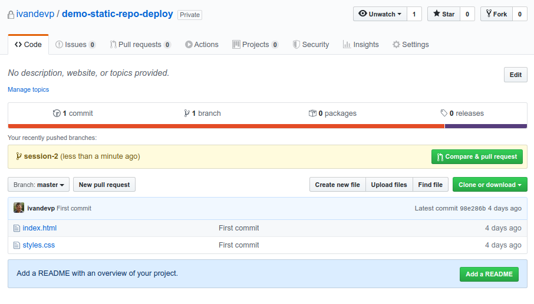
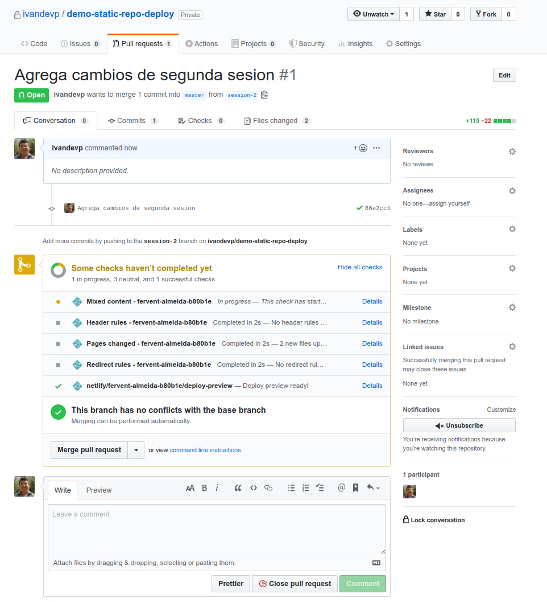

## Final Challenge: Agrega los estilos correctos al contenido principal

Te habrás dado cuenta que con lo visto hoy, puedes hacer cambios en los estilos
del HTML de la sesión anterior, como por ejemplo:

1. Cambia la fuente de los textos utilizados. Las que utiliza Matcha son privadas,
   pero tu puedes agregar fuentes gratuitas utilizando el repositorio de fuentes:
   [`Google Fonts`](https://fonts.google.com/).
2. Agrega las separaciones que existe entre cada texto que aparece en el
   contenido principal.
3. Cambia los estilos del formulario.

Vamos a hacer un challenge guiado, con una dinámica distinta, vas a aplicar
estos cambios en el repositorio de algunx de tus compañerxs:

1. Escoge un compañerx al que le harás una solicitud de cambio en su código, una
   vez sepas quién será (no importa si alguien más escoge a la misma persona),
   pídele el link de su repositorio de Github (que te lo comparta por slack tal
   vez).
2. Ingresa a su repositorio de Github y dale clic al botón de `Fork` ubicado a
   la misma altura que el nombre de su repositorio. Por ejemplo:

   

   Esto creará una copia del proyecto de tu compañerx en tu cuenta de Github,
   esto permitirá que puedas hacer cambios en su proyecto sin afectar lo que
   viene trabajando.

3. Clona su proyecto para empezar a realizar cambios, para esto, ingresa a tu
   carpeta general de proyectos en la terminal (en este ejemplo diremos que es
   la carpeta _Documents_) y ejecuta el comando de `git clone` seguido del link
   del repositorio que se creó en tu cuenta.

   ```bash
   $ # En el ejemplo de la imagen anterior, el link del proyecto se vería así:
   $ # https://github.com/ivandevp/demo-static-repo-deploy.git
   $ git clone https://github.com/<tu-usuario-github>/<nombre-del-proyecto>.git
   ```

   Una vez clonado, `git` habrá creado una carpeta con el nombre del repositorio
   (`demo-static-repo-deploy` en el caso del ejemplo) y podrás ingresar a ella
   para ver el código con el comando `cd`.

   ```bash
   $ # En el ejemplo sería: `cd demo-static-repo-deploy`
   $ cd <nombre-del-proyecto>
   ```

4. Antes de empezar a hacer tus cambios, vamos a crear una `rama` en la que
   podrás hacer modificaciones sin fastidiar a los demás miembros de tu equipo.
   El concepto de rama lo verás a profundidad en el postwork, de momento imagina
   que si estás en una línea de tiempo, acabas de crear una versión paralela
   donde tu podrás avanzar y hacer cambios sin alterar la línea de tiempo
   original. Sabemos que es complicado de imaginar y un concepto complejo de
   entender a la primera, pero estamos segurxs de que lo entenderás conforme lo
   vayas usando. Mientras, usa este comando en la terminal:

   ```bash
   # Los nombres de las ramas normalmente son en minúscula y si es más de una
   # palabra, va separada por guiones. Ejemplo: `estilos-navegacion`, `formulario`.
   # Normalmente trata de describir en pocas palabras en lo que trabajarás.
   # Para este ejemplo mi rama se llamará `estilos-generales`
   $ git checkout -b <nombre-rama> # git checkout -b estilos-generales
   ```

5. Realiza algún cambio, ayuda a tu compañerx a agregar un estilo o alguna
   etiqueta de HTML que le faltó en la sesión o cambia la fuente o color de algo
   que tu sientas le puede ayudar a que se vea mejor su proyecto, esta elección
   es tuya. Puedes usar los requerimientos del reto final si no tienes idea de
   qué agregar.
6. Una vez que hayas agregado tus cambios, agrégalos a `git`:

   ```bash
   $ git add .
   $ git commit -m "Cambia color de la fuente"
   # A diferencia de antes, el último comando, `git push`, se hace hacia la rama
   # que has creado, esto con la intención de que tus cambios se creen en la
   # línea de tiempo paralela y no la original.
   # En este ejemplo sería: `git push origin estilos-generales`
   $ git push origin <nombre-rama>
   ```

7. Esto habrá subido cambios a Github y te saldrá una alerta en tu copia del
   repositorio similar a la de la siguiente imagen:

   

   En este ejemplo, la rama se llama `session-2`, en tu caso, aparecerá el nombre
   de rama que elegiste. Dale click al botón `Compare & pull request`.

8. Te llevará a una página como la siguiente:

   

   Esto es el formulario de apertura de un Pull Request (solicitud de cambio).
   Normalmente te pondrá un título que será el mismo que usaste como mensaje del
   commit. Además te dejará un espacio para que agregues comentarios y dejes
   saber al autor original del proyecto qué cambios hiciste, te recomendamos que
   le escribas una descripción detallada de los cambios que hiciste, y una vez
   terminado le des clic al botón `Create pull request`.

9. Con esto habrás enviado una solicitud de cambio al repositorio de tu compañerx,
   ahora queda en él/ella que lo acepte o rechace (esperemos que lo acepte). El
   Pull Request se verá algo como:

   

   Si tu compañerx decide aceptarlo, hará clic en el botón `Merge pull request`,
   caso contrario, le dará en `Close pull request`, en caso de usar este último
   botón, es aconsejable comentar antes el porqué no lo piensa aceptar.

   Con esto habrás realizado lo que se conoce como una [`contribución`](https://blog.nearsoftjobs.com/tu-primera-contribuci%C3%B3n-a-open-source-un-ganar-ganar-c5c93fbb93eb)
   en el mundo del desarrollo de software open source.
