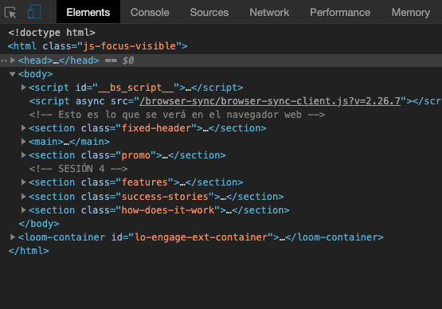
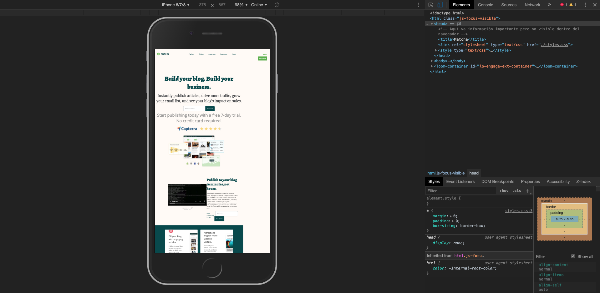
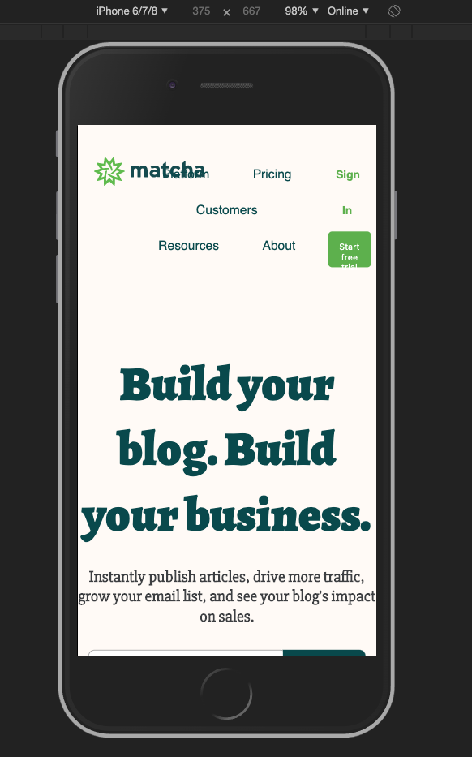
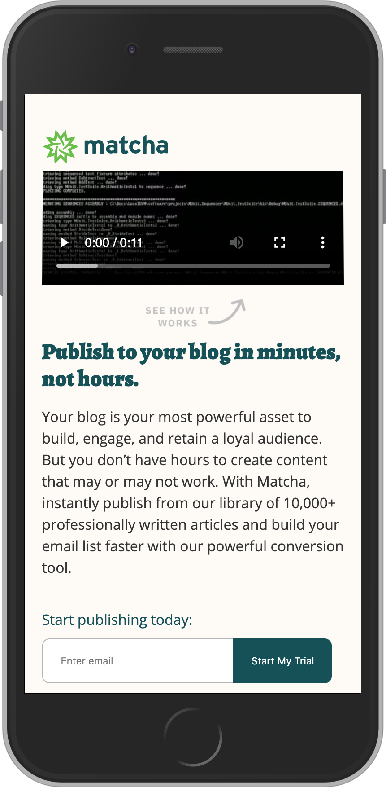
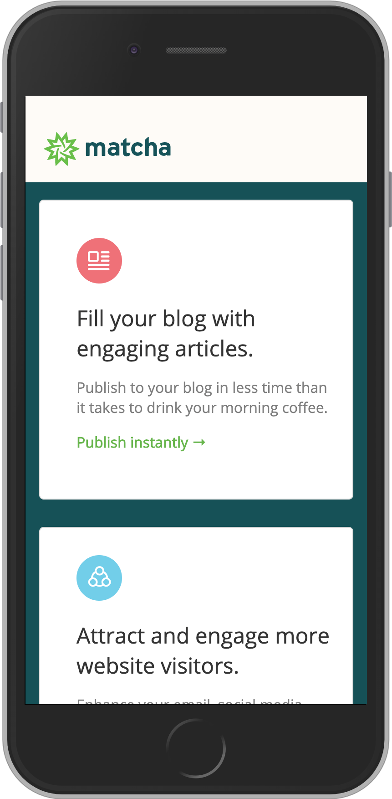

# Sesión: Agregando filas y columnas con CSS Grid

Sigue el contenido a continuación durante clase para que no te pierdas ningún
detalle de lo que estás a punto de aprender.

## Objetivos

En esta sesión aprenderás:

- Adaptar nuestro contenido para que pueda ser visible en dispositivos más 
  pequeños.
- Personalizar la apariencia de acuerdo al dispositivo desde el que se ve 
  nuestra web.
- Resolver conflictos de git cuando obtenemos cambios realizados por terceros.
- Desplegar los cambios a nuestra página web hosteada en Netlify.

## Contenido

### Bonus: Resolviendo conflictos de Git

Desde algunas sesiones pasadas, hemos visto como trabajar con git de forma 
colaborativa a partir de la creación de ramas y Pull Requests enviados a 
repositorios que no nos pertenecen. Sin embargo, puede que ya te haya sucedido
que al momento de obtener los cambios, te haya salido un mensaje final indicando
que hubo un conflicto para hacer el _merge_.

Esto normalmente sucede cuando tocamos un mismo archivo o porción de código que
es modificado tanto en nuestro computador como en otro. Por ello, como lo hemos
mencionado anteriormente, siempre es bueno tener actualizada nuestras ramas y
mantener una buena coordinación entre equipo. Vamos a ver un flujo de ejemplo
de cómo resolver conflictos en Git.

Imaginemos que nosotros tenemos en la computadora del trabajo, una estructura 
como la siguiente:

```html
<section class="features">
  <div class="feature-tarjeta"></div>
  <div class="feature-tarjeta"></div>
  <div class="feature-tarjeta"></div>
  <div class="feature-tarjeta"></div>
</section>
```

Sin embargo, en tu casa tu aplicaste ciertas mejoras a tu código como:

```html
<section class="features">
  <article class="feature-card"></article>
  <article class="feature-card"></article>
  <article class="feature-card"></article>
  <article class="feature-card"></article>
</section>
```

Y como estabas muy seguro de tus cambios, te pusiste a agregar otras cosas a 
tu HTML en la computadora de tu trabajo:

```html
<section class="features">
  <div class="feature-tarjeta"></div>
  <div class="feature-tarjeta"></div>
  <div class="featurer-footer">
    <p>Este es un footer que por alguna razón existe en esta sección</p>
  </div>
  <div class="feature-tarjeta"></div>
  <div class="feature-tarjeta"></div>
</section>
```

Y ahora nos ponemos a agregarlo a Git, sin embargo al hacer `git push` obtenemos
algo similar a:

```bash
# git push <nombre-remoto> <nombre-rama>
$ git push origin master
To https://github.com/<nombre-usuario>/<nombre-repositorio>.git
 ! [rejected]        master -> master (non-fast-forward)
error: failed to push some refs to 'https://github.com/<nombre-usuario>/<nombre-repositorio>.git'
hint: Updates were rejected because the tip of your current branch is behind
hint: its remote counterpart. Merge the remote changes (e.g. 'git pull')
hint: before pushing again.
hint: See the 'Note about fast-forwards' in 'git push --help' for details.
```

Este mensaje lo que nos trata de decir es que hay cambios que están en Github,
pero que en nuestra máquina actual no están presentes. La solución que nos 
recomienda es hacer `git pull` primero para obtener los cambios y luego recién
hacer un `git push`. A lo cual procedemos a obedecer:

```bash
# git pull <nombre-remoto> <nombre-rama>
$ git pull origin master
remote: Counting objects: 5, done.
remote: Compressing objects: 100% (2/2), done.
remote: Total 3 (delta 1), reused 3 (delta 1)
Unpacking objects: 100% (3/3), done.
From https://github.com/<nombre-usuario>/<nombre-respositorio>
 * branch            master     -> FETCH_HEAD
Auto-merging mars.txt
CONFLICT (content): Merge conflict in /ruta/a/archivo.html
Automatic merge failed; fix conflicts and then commit the result.
```

La penúltima línea nos va a indicar que hubo un conflicto (`CONFLICT`) en el
archivo que indica la ruta. Dado que tenemos un conflicto, no nos permite hacer
push hasta que lo solucionemos.

Entonces, ¿cómo resolvemos un conflicto? Primero debemos de tener claro que git
crea un conflicto cuando no sabe exactamente qué cambio prevalecer cuando se
mezclan 2 versiones distintas de código. En nuestro ejemplo esto sucedió porque
seguimos avanzando en agregar código sin haber actualizado lo que teníamos en 
nuestra computadora y al traer los nuevos cambios, debido a que modificamos el
mismo archivo y casi las mismas líneas, git no sabe si el cambio que acabamos de
hacer es el que debe quedar o si debería quedar el que acabamos de obtener. Para 
esto, nos pedirá que manualmente solucionemos dichos conflictos y eso lo logramos
ingresando a nuestro archivo que indica el resultado de git visto anteriormente 
(`/ruta/a/archivo.html` en nuestro ejemplo).

```html
<section class="features">
<<<<<<< HEAD
  <div class="feature-tarjeta"></div>
  <div class="feature-tarjeta"></div>
  <div class="featurer-footer">
    <p>Este es un footer que por alguna razón existe en esta sección</p>
  </div>
  <div class="feature-tarjeta"></div>
  <div class="feature-tarjeta"></div>
=======
  <article class="feature-card"></article>
  <article class="feature-card"></article>
  <article class="feature-card"></article>
  <article class="feature-card"></article>
>>>>>>> dabb4c8c450e8475aee9b14b4383acc99f42af1d
</section>
```

Como vemos en el archivo del ejemplo, la parte que no cambió no está encerrada
enter los símbolos (`<<<<<<<`, `=======`, `>>>>>>>`), mientras que el resto si
se queda encerrado. Dependiendo del editor que usemos para ver estos cambios 
puede que la experiencia de solucionar el conflicto varíe, pero para nuestro 
caso imaginemos que el editor no nos dice y nosotros solo vemos esos símbolos 
raros. Lo que esto indica, es que la primera parte (entre `<<<<<<<` y `=======`) 
es lo que actualmente tenemos en nuestra computadora, mientras que la segunda 
(`=======` y `>>>>>>>`) es lo que acaba de obtener de Github. Dependiendo de lo
que nosotros querramos mantener en el código final, podríamos eliminar solo 
alguna de las partes y asegurarnos que ninguno de los símbolos se quedan en el
código; sin embargo, nosotros tenemos una peculiaridad porque necesitamos 
porciones de ambas partes, por lo que necesitaremos modificar el código de tal 
forma que quede algo como:

```html
<section class="features">
  <article class="feature-card"></article>
  <article class="feature-card"></article>
  <div class="featurer-footer">
    <p>Este es un footer que por alguna razón existe en esta sección</p>
  </div>
  <article class="feature-card"></article>
  <article class="feature-card"></article>
</section>
```

De tal forma ya no tendríamos conflicto y ahora tendríamos que generar un commit
indicando que ya solucionamos los conflictos. Tener en cuenta que si no hacemos
un commit es como si no hubiéramos solucionado nada.

```bash
$ git add /ruta/a/archivo.html
$ git commit -m "Corrige conflictos"
[master 07ebc69] Corrige conflictos
 1 file changed, 1 insertion(+)
```

Y finalmente ya podemos subir nuestros cambios a Github a través del comando
`git push` para poder tener todo sincronizado.

```bash
# git push <nombre-remoto> <nombre-rama>
$ git push origin master
remote: Counting objects: 10, done.
remote: Compressing objects: 100% (4/4), done.
remote: Total 6 (delta 2), reused 6 (delta 2)
Unpacking objects: 100% (6/6), done.
From https://github.com/<nombre-usuario>/<nombre-repositorio>
 * branch            master     -> FETCH_HEAD
Updating dabb4c8..2abf2b1
Fast-forward
 /ruta/a/archivo.html | 2 +-
 1 file changed, 1 insertion(+), 1 deletion(-)
```

Así que no olvides sincronizar siempre tus ramas para asegurarte que no te 
generen conflictos cuando trabajas en equipo o simplemente usas más de un 
ordenador para hacer cambios en tu código.

### Adaptando nuestra página a varios dispositivos

Nuestra página actualmente ha agarrado forma y se ve decentemente bien. 
Sin embargo, ¿has intentado abrir tu página desde un móvil o una tablet? Si en
caso ya lo hiciste, probablemente te habrás percatado que no se ve igual que en
el navegador web de tu computador. Esto es normal, así que no te preocupes, 
ahora veremos como dejar igual de bonita tu página en varios dispositivos.

#### Guía: Inspeccionando tu sitio desde un móvil

Para poder adaptar nuestra página a un móvil por ejemplo, necesitamos saber cómo
se ve actualmente, y si bien podríamos agarrar nuestro celular y entrar a la 
página que tenemos hospedada en Netlify, no nos ayudaría mucho porque queremos
realizar cambios y ver inmediatamente cómo resulta dicho cambio, como lo hemos
venido haciendo para desarrollar nuestra página en el navegador. 

Debido a que esto es algo común para los desarrolladores web, los navegadores
han implementado un visualizador responsivo en sus herramientas de desarrollo
que nos permiten emular la experiencia que un usuario desde un dispositivo 
distinto a una laptop o computadora tiene cuando entra a nuestra página, lo mejor
es que si nosotros realizamos algún cambio, este se podrá ver reflejado y 
podremos analizar si el cambio fue el correcto y/o esperado.

Para entrar en este modo responsivo, debemos ingresar a las herramientas de
desarrollo de nuestro navegador y en la parte superior donde muestra diversas
pestañas (entre ellas la de `Elements` o `Elementos` que hemos ido usando a lo
largo de este curso), aparecerá al lado izquierdo un ícono de la forma de un
móvil y una tablet detrás, si damos click sobre dicho ícono, se sombreará y el
espacio de nuestra web cambiará.



#### Challenge: Personaliza tu emulador de experiencia móvil

En la parte superior de la página saldrá algunas opciones que se pueden aplicar
para personalizar la apariencia del emulador de apariencia móvil que estamos
usando.

¿Qué tal si averiguas como personalizar la apariencia de tu emulador de tal forma
que quede algo similar a la que te presentamos en la siguiente imagen?



Una vez logrado, puedes cambiar la apariencia a cualquier otra que te guste más.

***

Bueno, luego de experimentar un poco con las herramientas de desarrollo del 
navegador debemos de volver a enfocarnos al objetivo de nuestra sesión, si nos
damos cuenta, nuestra web es casi ilegible desde un móvil y no es fácil de 
consumir para nuestros usuarios.

#### Guía: Agregando meta viewport

Antes de personalizar la apariencia en la experiencia móvil de nuestro sitio,
debemos de agregar una etiqueta de metadatos que permite al navegador saber
cómo manejar nuestro sitio cuando se accede desde un tipo de dispositivo 
diferente. 

Estamos hablando de una etiqueta `<meta />` que nos permite establecer 
características por defecto de nuestror `viewport`. 

```html
<!DOCTYPE html>
<html>
  <head>
    <meta name="viewport" content="width=device-width,initial-scale=1.0,user-scalable=no" />
    <!-- Resto de etiquetas del head -->
  </head>
  <body>
    <!-- ... -->
  </body>
</html>
```

:::tip

Notar que hemos puesto esta etiqueta `<meta />` dentro del `<head></head>` de 
nuestro código y no dentro del `<body></body>` como la mayoría de etiquetas que
hemos ido aprendiendo hasta el momento. Esto es debido a que no tiene ninguna 
representación visual y sobretodo sirve para informar al navegador de cómo tratar
cierto tipo de contenido.

:::

En el valor del atributo `content` de esta etiqueta hemos establecido ciertas
reglas tales como indicar que el width siempre va a hacer el tamaño del dispositivo
del cuál se está viendo nuestro sitio web, a su vez, por defecto indicamos que 
la escala inicial de la página es de 1, esto nos sirve para dispositivos táctiles 
que tienen capacidad de hacer zoom y que pueden alterar la escala en la que se 
visualiza la página y por último indicamos que el usuario no pueda hacer zoom 
desde una pantalla táctil.

Aplicando este cambio a nuestro sitio veremos que todo el texto se sobrepone y
que la experiencia termina siendo muy mala. Ejemplo:



#### Guía: Ocultando la barra de navegación en móviles

Lo primero que podemos notar es que nuestra barra de navegación se distorsiona
y termina viéndose mal, debido a muchos factores, tal vez el más importante que
es mucho contenido para el tamaño de nuestros dispositivos. ¿Qué tal si lo 
ocultamos para que no se puedan visualizar mientras estemos en dispositivos 
móviles?

#### Concepto: Media queries

Una forma de agregar condiciones de estilos en base a tamaño de dispositovos es 
a través de la característica de CSS llamada `media queries`. Esta característica
nos permite sobreescribir diferentes estilos en base a condiciones (breakpoints)
que nosotros podemos definir.

Veamos un ejemplo de la sintaxis:

```css
@media (breakpoint) {
  /** Aplica estilos particulares para este tamaño */
}
```

Los breakpoints son las condiciones que nosotros establecemos, normalmente en 
base al ancho de un dispositivo, también se pueden agrupar un conjunto de 
condiciones en un mismo _media query_. 

```css
@media (max-width: 575px) { 
  body {
    background-color: yellow;
  }
}
```

En el ejemplo estamos diciendo que todos los dispositivos que tengan un ancho
máximo de `575px` tendrá un color de fondo amarillo, si puebas esto en tu 
proyecto, verás que en una vista móvil el fondo será amarilla, pero si sales del
emulador, tu página volverá a tener el colo de fondo que tenía antes. Este es el
pode que los _media queries_ te dan. Nosotros trabajaremos con los siguientes
breakpoints para personalizar nuestros estilos:

```css
/** dispositivos móviles en vista viewport (vertical) */
@media (max-width: 575px) { ... }

/** dispositivos pequeños en vista landscape (horizontal) */
@media (min-width: 576px and max-width: 767px) { ... }

/** dispositivos medianos (tablets) */
@media (min-width: 768px and max-width: 991px) { ... }

/** dispositivos grandes (desktops) */
@media (min-width: 992px and max-width: 1199px) { ... }

/** dispositivos extra grandes (monitores grandes, tvs) */
@media (min-width: 1200px) { ... }
```

##### Ocultando menú de navegación

Ahora que ya sabemos que los _media queries_ nos ayudarán a lograr esto, 
pongámoslo en práctica. Primero debemos identificar qué selector usar para 
encontrar solo el menú de navegación, ya que el logo si se logra visualizar
correctamente.

En la estructura que seguimos en el ejemplo, encontramos lo siguiente:

```html
<section class="fixed-header">
  <header class="header">
    <a href="/" class="logo">
      
    </a>
    <nav class="navbar">
      <ul class="menu">
        <li class="menu-item">Platform</li>
        <li class="menu-item">Pricing</li>
        <li class="menu-item">Customers</li>
        <li class="menu-item">Resources</li>
        <li class="menu-item">About</li>
      </ul>
    </nav>
    <div class="actions">
      <a>Sign In</a>
      <button>Start free trial</button>
    </div>
  </header>
</section>
```

Para este caso, el contenido a ocultar son los que podemos acceder a través
de `.navbar` y `.actions`. Procedamos a cambiar su display.

```css
@media (max-width: 575px) {
  .navbar,
  .actions {
    display: none;
  }
}
```

!Gran trabajo! Ya hemos ocultado nuestro menú de navegación manteniendo el logo
visible, y ya no se ve tan mal dicha sección. En la siguiente sesión veremos 
como recuperar este contenido con una experiencia diferente.

#### Challenge: Cambiando la fuente de nuestro título principal

El título de nuestra página está tomando demasiado espacio y no se ve bien, esto
se debe a que tiene una fuente fija de `60px` para el ejemplo que usamos en esta
guía. ¿Cómo harías para cambiarle de fuente a una que funcione mejor? 

> Nota: En nuestro caso, terminaremos usando una fuente de 30px pero puedes usar
> el tamaño que prefieras.

<details>
  <summary>Posible Solución</summary>

```css
@media (max-width: 575px) {
  .navbar,
  .actions {
    display: none;
  }

  h1 {
    font-size: 30px;
  }
}
```

</details>

#### Challenge: Quitando separación superior del título

Si nos fijamos en la página original, el título no queda tan seeparado del borde
superior, esto se debe a la misma razón que el caso anterior, ¿cómo harías para
mejorar su apariencia?

<details>
  <summary>Posible Solución</summary>

```css
@media (max-width: 575px) {
  .navbar,
  .actions {
    display: none;
  }

  main {
    margin-top: 130px;
  }

  h1 {
    font-size: 30px;
  }
}
```

</details>

#### Guía: Ajustando el ancho del banner Capterra

Si bien nuestra página principal ya va tomando una mejor apariencia, la imagen
con el texto _Capterra_ y las estrellas se desbordan del ancho del dispositivo,
esto normalmente es debido a que el ancho de la imagen supera el ancho 
disponible en el dispositivo.

Si analizamos el banner nos vamos a dar cuenta que esta no cuenta con estilos,
para adaptarlo al ancho del dispositivo podemos establecerle un `width: 100%`
cuando se encuentre en dispositivos pequeños, ya que si lo aplicamos de forma
genérica afectaríamos su apariencia en dispositivos medianos y grandes (donde ya
se veían bien).

Agreguemos una clase al banner y modifiquemos sus estilos:

```html
<main>
  <!-- Contenido previo al banner -->
  <figure class="banner">
    
  </figure>
  <!-- Contenido posterior al banner -->
</main>
```

```css
@media (max-width: 575px) {
  /** Media queries previos al banner **/
  .banner > img {
    width: 100%;
  }
}
```

Con los cambios realizados hasta el momento, nuestra web en dispositivos 
pequeños deberían de verse así:


#### Guía: Manejando el responsive de la sección de publicidad

Si hacemos un poco de scroll hacia la parte inferior de la página, nos daremos
cuenta que las siguientes secciones están desbordadas y no se ven bien ya que
incluso generan un scroll horizontal (debido al desborde en mención). Iremos
corrigiendo esto sección por sección. Empecemos por la sección de publicidad que
está estructurada con propiedades de **Flexbox**.

El motivo de desborde en esta sección es que nosotros esperamos que la pantalla
se divida en 2 partes iguales hoizontalmente hablando para que de un lado se 
muestre el video y dek otro el call to action de publicidad, sin embargo el 
ancho del video es muy grande como para que alcance el texto a su lado. Debido
a esto, lo que haremos será cambiar la dirección del flujo de nuestra sección.
Es decir, actualmente nuestro _flex container_ tiene la propiedad por defecto
de `flex-direction: row;` que lo alínea uno al lado del otro, lo cambiaremos por
un `flex-direction:column;` para que vaya uno debajo del otro, ajustaremos el 
ancho de tal forma que no haya un desborde y reduciremos el tamaño de la fuente
para tener una jerarquía correctamente organizada.

Teniendo en cuenta nuestra estructura:

```html
<section class="promo">
  <article class="explanatory-video">
    <video
      controls
      poster="https://cdn.videvo.net/videvo_files/video/premium/video0036/thumbnails/computer_code00_small.jpg"
    >
      <source
        type="video/webm"
        src="https://cdn.videvo.net/videvo_files/video/premium/video0036/small_watermarked/computer_code00_preview.webm"
      />
      <source
        type="video/mp4"
        src="https://cdn.videvo.net/videvo_files/video/premium/video0036/small_watermarked/computer_code00_preview.mp4"
      />
    </video>
    
  </article>
  <article class="publish">
    <h3>Publish to your blog in minutes, not hours.</h3>
    <p>
      Your blog is your most powerful asset to build, engage, and retain a
      loyal audience. But you don’t have hours to create content that may or
      may not work. With Matcha, instantly publish from our library of
      10,000+ professionally written articles and build your email list
      faster with our powerful conversion tool.
    </p>
    <form>
      <p>Start publishing today:</p>
      <div>
        <input type="text" placeholder="Enter email" />
        <button>Start My Trial</button>
      </div>
    </form>
  </article>
</section>
```

Empecemos por cambiar la dirección de nuestro contenedor en dispositivos 
pequeños:

```css
@media (max-width: 575px) {
  /** Media queries previos al banner **/
  .promo {
    flex-direction: column;
  }
}
```

Con este simple cambio nuestro texto de _call to action_ se movió a la parte 
inferior del video, sin embargo, si inspeccionamos los estilos que este contiene
notaremos que tiene un `max-width: 70%;` que nos ayudaba a poner un margen a los 
lados parar que se vea centrado. En la experiencia móvil, si bien deseamos 
mantener un margen, no debería ser tan grande dado que contamos con menos 
espacio por lo que lo moveremos a un `90%` y ajustaremos el ancho del video para
que respete este ancho también.

```css
@media (max-width: 575px) {
  /** Media queries previos al banner **/
  .promo {
    flex-direction: column;
    max-width: 90%;
  }

  .explanatory-video > video {
    width: 100%;
  }
}
```

Ahora ajustaremos el tamaño de la fuente del título promocional para que se 
ajuste a la jerarquía de información que tenemos en nuestra página:

```css
@media (max-width: 575px) {
  /** Media queries previos al banner **/
  .promo {
    flex-direction: column;
    max-width: 90%;
  }

  .explanatory-video > video {
    width: 100%;
  }
  
  .publish {
    margin-top: 10px;
  }

  .publish > h3 {
    font-size: 25px;
    line-height: 1.2;
  }
}
```

:::tip
El valor que hemos asignado a la propiedad `line-height` no tiene una medida,
te recomendamos averiguar cómo se calcula el valor final de esta propiedad.

Puedes consultar la [documentación de MDN](https://developer.mozilla.org/es/docs/Web/CSS/line-height).
:::

Adicionalmente, cambiamos el margen superior para agregar una separación entre
el video y el texto, y también fue necesario cambiar la propiedad `line-height`
ya que el tamaño fijo que esta contenía era mucho para el nuevo tamaño.

Por último, nos falta editar el formulario de registro.

#### Challenge: Cambiando el flujo del formulario de registro en la sección de publicidad

El formulario está siendo desbordado debido a que está alineado en un flujo 
horizontal (`row`), para mejorar esta experiencia es necesario volverlo vertical.
¿Cómo hacemos?

:::tip
El contenedor del formulario usa Flexbox.
:::


<details>
  <summary>Posible Solución</summary>

```css
@media (max-width: 575px) {
  .publish > form {
    flex-direction: column;
  }

  .publish > form > div {
    height: 50px;
    margin-top: 10px;
  }

  .publish > form > div > input {
    width: 65%;
  }
}
```

Adicionalmente agregamos algunos estilos para mejorar la apariencia y ancho de
nuestro formulario.

</details>

Luego de hacer estos cambios nuestra sección promocional debería quedar algo 
similar a:



#### Guía: Haciendo responsive la sección de características principales

De momento ya tenemos de manera responsive nuestra portada inicial, 
≥adicionalmente acabamos de cambiar el flujo de nuestra sección publicitaria
que usa Flexbox. La siguiente sección que corresponde a la de publicidad no se
desborda del ancho del dispositivo pero debido a que está estructurada con Grid
CSS, está manteniendo la cantidad de columnas y filas que definimos cuando estaba
en un dispositivo más grande. Para solucionar este problema, es necesario cambiar
la relación de filas y columnas. En este caso, sería bueno mantener cuatro filas
y una columna, para que cada tarjeta vaya debajo una de la otra.

Tomando en consideración la estructura:

```html
<section class="features">
  <article class="feature-card">
  </article>
  <article class="feature-card">
  </article>
  <article class="feature-card">
  </article>
  <article class="feature-card">
  </article>
</section>
```

Podemos cambiar el CSS para dispositivos pequeños:

```css
@media (max-width: 575px) {
  /** Estilos para la sección principal y de publicidad */
  .features {
    grid-template: repeat(4, 1fr) / 1fr;
  }
}
```

Bien, con esto ya logramos posicionar las tarjetas en un flujo vertical, sin 
embargo faltan 2 cosas, quitar el espacio a los lados y quitar la imagen que no
es necesaria mostrarla en la experiencia móvil.

#### Challenge: Mejorando la experiencia móvil de las tarjetas de características

Hasta este punto tenemos las características alineadas correctamente, sin embargo,
todavía no dan una buena apariencia, debido al ancho que ocupan en la pantalla 
se ve reducido y también porque la imagen no da una buena experiencia en este
tamaño de pantalla. ¿Cómo la mejoramos?


<details>
  <summary>Posible Solución</summary>

```css
@media (max-width: 575px) {
  /** Estilos de portada principal y sección de publicidad */
  .features {
    grid-template: repeat(4, 1fr) / 1fr;
    padding-left: 0;
    padding-right: 0;
  }
  
  .feature-image {
    display: none;
  }
}
```
</details>

En este punto ya hemos visto como realizar media queries para poder cambiar la
apariencia en un dispositivo con dimensiones diferentes a la de nuestro ordenador,
cambiamos posicionamiento que estaba estructurado con propiedades de `display`,
layout diseñado con `Flexbox` y `CSS Grid`. El resultado de esta sección debe 
verse algo similar a:



### Desplegando nuestros cambios

Esto probablemente ya lo has venido haciendo muchas veces, pero no está demás
recordarlo.

Agrega tus cambios realizados a `git`:

```bash
$ git add -A
```

Agrega un mensaje descriptivo a tu nueva versión:

```bash
$ git commit -m "Adapta sitio web a diferentes dispositivos"
```

Sube tus cambios a Github para que tengas un respaldo y siempre lo puedas
descargar en cualquier otro ordenador:

```bash
$ git push origin <nombre-rama> # `master` si no estás trabajando en otra rama
```

Al realizar este último comando tus cambios estarán reflejados en `Netlify` y
podrás revisar tu web publicada en internet, esperando que se vea algo como (o
incluso mucho mejor):

