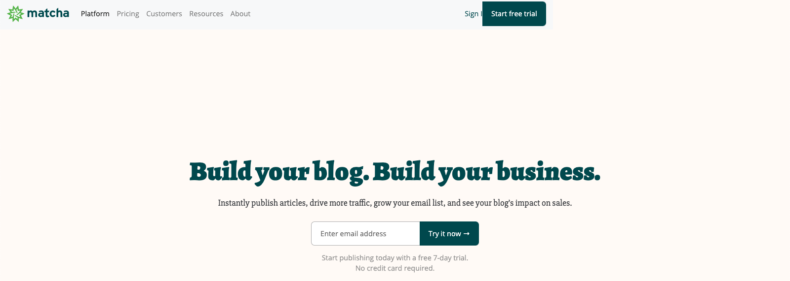

# Personaliza el contenido de tu navbar

## REQUISITOS
- Tener Git Bash si usas Windows.
- Conocer como instalar Bootstrap.

## INSTRUCCIONES

Cambia el texto usado en el navbar por defecto al contenido que actualmente
tenemos en nuestra página.

<details>
  <summary>Posible solución</summary>

```html
<body>
  <!-- Nuestra barra de navegación comentada va aquí -->
  <nav class="navbar navbar-expand-lg navbar-light bg-light">
    <a class="navbar-brand" href="#">
      
    </a>
    <button
      class="navbar-toggler"
      type="button"
      data-toggle="collapse"
      data-target="#navbarSupportedContent"
      aria-controls="navbarSupportedContent"
      aria-expanded="false"
      aria-label="Toggle navigation"
    >
      <span class="navbar-toggler-icon"></span>
    </button>

    <div class="collapse navbar-collapse" id="navbarSupportedContent">
      <ul class="navbar-nav mr-auto">
        <li class="nav-item active">
          <a class="nav-link" href="#">Platform</a>
        </li>
        <li class="nav-item">
          <a class="nav-link" href="#">Pricing</a>
        </li>
        <li class="nav-item">
          <a class="nav-link" href="#">Customers</a>
        </li>
        <li class="nav-item">
          <a class="nav-link" href="#">Resources</a>
        </li>
        <li class="nav-item">
          <a class="nav-link" href="#">About</a>
        </li>
      </ul>
      <form class="form-inline my-2 my-lg-0">
        <a>Sign In</a>
        <button>Start free trial</button>
      </form>
    </div>
  </nav>
</body>
```

Viéndose algo como:



</details>
