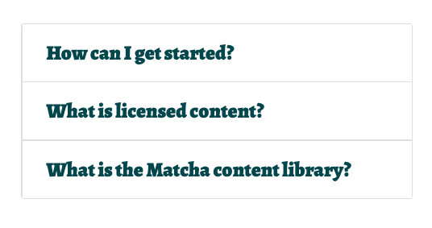

# Cambiando la información del acordión

## REQUISITOS
- Tener Git Bash si usas Windows.
- Conocer como instalar Bootstrap.

## INSTRUCCIONES

Reconoce la estructura del acordión e identifica los lugares en los que se debe
modificar para cambiar el contenido del mismo.

Verifica los enlaces en la respuesta y trata de cambiar los estilos de los
textos para que queden algo similar a:



<details>
  <summary>Posible solución</summary>

```html
<section class="faq">
  <div class="accordion" id="first-column-accordion">
    <div class="card">
      <div class="card-header" id="get-started-heading">
        <h2 class="mb-0">
          <button
            class="btn btn-link"
            type="button"
            data-toggle="collapse"
            data-target="#get-started-collapse"
            aria-expanded="false"
            aria-controls="get-started-collapse"
          >
            How can I get started?
          </button>
        </h2>
      </div>

      <div
        id="get-started-collapse"
        class="collapse"
        aria-labelledby="get-started-heading"
        data-parent="#first-column-accordion"
      >
        <div class="card-body">
          Getting started is easy! Simply
          <a href="#">create a free account</a> to start using the Platform and
          exploring the library. Want to start publishing? When you click the
          “Publish” button on a piece of licensed content, you’ll be prompted to
          input your credit card information before continuing. Questions?
          <a href="#">Reach out to our customer support team for assistance!</a>
        </div>
      </div>
    </div>
    <div class="card">
      <div class="card-header" id="license-content-heading">
        <h2 class="mb-0">
          <button
            class="btn btn-link collapsed"
            type="button"
            data-toggle="collapse"
            data-target="#license-content-collapse"
            aria-expanded="false"
            aria-controls="license-content-collapse"
          >
            What is licensed content?
          </button>
        </h2>
      </div>
      <div
        id="license-content-collapse"
        class="collapse"
        aria-labelledby="license-content-heading"
        data-parent="#first-column-accordion"
      >
        <div class="card-body">
          Licensed content, sometimes called syndicated content, is content
          produced by a professional publisher that can be legally licensed for
          use on your own website with no SEO penalty.
          <a href="#">Learn more</a>. The Matcha library leverages licensed
          content to provide you with a low-cost supply of professionally
          written articles that are proven to be engaging. It eliminates the
          headache and time of producing your own blog articles, allowing you to
          get back to more pressing matters. When we say, “professional
          publishers”, we mean it. Currently, our library includes articles from
          the following publishers: Oxygen Magazine, Better Nutrition, Popular
          Science, Field & Stream, Coach, RootsRated, Business2Community,
          MoneyNing, YourMoneyGeek Working Mother, Clean Eating, and Healthy
          Moms Magazine.
        </div>
      </div>
    </div>
    <div class="card">
      <div class="card-header" id="library-content-heading">
        <h2 class="mb-0">
          <button
            class="btn btn-link collapsed"
            type="button"
            data-toggle="collapse"
            data-target="#library-content-collapse"
            aria-expanded="false"
            aria-controls="library-content-collapse"
          >
            What is the Matcha content library?
          </button>
        </h2>
      </div>
      <div
        id="library-content-collapse"
        class="collapse"
        aria-labelledby="library-content-heading"
        data-parent="#first-column-accordion"
      >
        <div class="card-body">
          Matcha offers a library of more than 10,000 articles with photography
          and written by high-quality third-party publishers. You can publish an
          article from the library to your blog in a matter of minutes. In 2018
          alone, our articles garnered 8.9 million website visits for our
          customers. The data shows that readers find the articles engaging and
          perform as well or better than custom articles. You can see the study
          <a href="#">here</a>. Every week, we are bringing in hundreds of new
          articles to our library. Our library publishers include: Oxygen
          Magazine, Better Nutrition, Popular Science, Field & Stream, Coach,
          RootsRated, Business2Community, MoneyNing, YourMoneyGeek Working
          Mother, Clean Eating, and Healthy Moms Magazine.
        </div>
      </div>
    </div>
  </div>
</section>
```

```css
.faq {
  background-color: white;
  padding-bottom: 120px;
}

.faq h2 {
  color: #025157;
  font-family: "Alegreya", serif;
  margin-bottom: 60px;
}

.faq .card-header {
  background-color: white;
  border-left: 1px solid rgba(0, 0, 0, 0.125);
}

.faq .card-header h2 > button {
  color: #025157;
  font-size: 28px;
}

.faq .card .card-body a {
  color: #6abf4b;
}
```

</details>

Yay! Con esto ya vimos un nuevo componente, ¿te has puesto imaginar cómo haríamos
para poder agregar la siguiente columna? Si pasó por tu mente cosas como Flexbox,
Grid CSS, o display y floats. Cualquiera es un approach correcto, sin embargo,
Bootstrap tiene utilidades para controlar el layout en formato de [Grid](https://getbootstrap.com/docs/4.4/layout/grid/).
